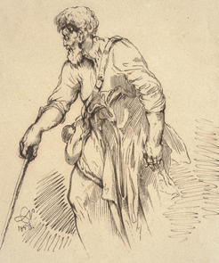
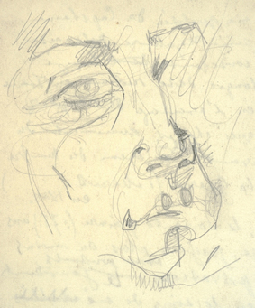
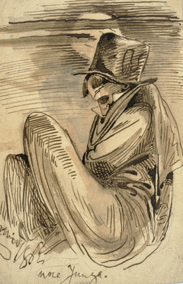

title: Paintings & Drawings of Cyprian Norwid
description: Norwid's artistic range stretched beyond writing to include drawing and painting

#Drawings

Norwid's life was rich with artistic work.

His artistic range stretched to include drawings and paintings.

<a href = "https://polona.pl/items/?filters=creator:%22Norwid,_Cyprian_Kamil_(1821--1883)%22,public:0,hasTextContent:0" target="_blank">Biblioteka Narodowa</a> <i class="material-icons">open_in_new</i> makes available digital versions of original manuscripts and drawings by Cyprian Norwid.

