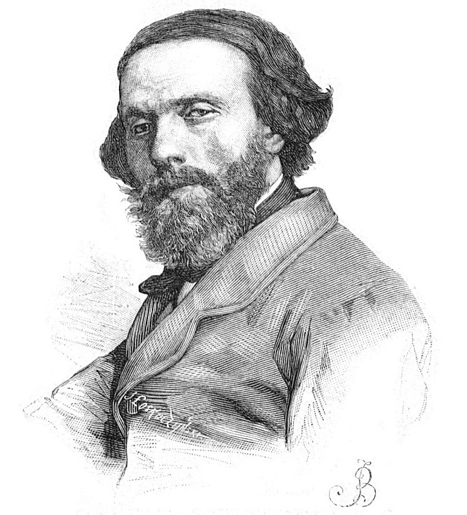

#The Art & Work of Cyprian Norwid

His Life & Times

---
##Cyprian Kamil Norwid

**Cyprian Kamil Norwid** was a Polish writer **(1821-1883)**.

His work, rediscovered today, provides an insight into the mind of an artist trying to make sense of the world in his unique way - through his religion, upbringing, language and history.

Having his work read by future generations was one of his hopes.

---

???+ note "*** Norwid News ***"
    <a href="https://www.polskieradio.pl/7/5609/Artykul/2275949,Milosc-czysta-u-kapieli-morskich" target="_blank">"Miłość - czysta u kąpieli morskich" - komedia Cypriana Kamila Norwida - </a> <i class="material-icons">open_in_new</i> - Polskie Radio PL presents a short Norwid comedy.

    <a href="http://Norwidiana.blogspot.com" target="_blank">Norwidiana.blogspot.com </a> <i class="material-icons">open_in_new</i> - is as close as I can find to a site that posts **updated** news about a writer who died in 1883.

    <a href="http://fundacjamuseionnorwid.pl" target="_blank">Fundacja Museion Norwid</a> <i class="material-icons">open_in_new</i> - the plan to open a museum dedicated to Norwid in 2021 on the 200th anniversay of his birth.

    <a href="http://czasopisma.tnkul.pl/index.php/sn/issue/view/463"  target="_blank">Studia Norwidiana</a> <i class="material-icons">open_in_new</i>  - the first English translation of "Studia Norwidiana" available in PDF.

---

##Norwid - 3 English Translations

Reading Norwid in Polish one can hear the author's unique voice. Translators have a difficult task in trying to interpret, translate and maintain that voice. 

[Read](poetry/translation/index.md) English versions of one of Norwid's short poems as interpreted by 3 different translators.

---

## Norwid in Song

Norwid's work has inspired artists to produce musical interpretations of his writings.

### [Daj Mi Wstążkę Błękitną](poetry/selected/#daj-mi-wstazke-bekitna)

Performed by <a href="https://en.wikipedia.org/wiki/Czes%C5%82aw_Niemen" target="_blank">Czesław Niemen</a> <i class="material-icons">open_in_new</i>.

<iframe width="560" height="315" src="https://www.youtube.com/embed/z9raxSMfGq4?rel=0" frameborder="0" allowfullscreen></iframe>
---

### [W Weronie](/poetry/vademecum/vademecum1/#vi-w-weronie) 

Performed by <a href="https://pl.wikipedia.org/wiki/Wanda_Warska" target="_blank">Wanda Warska</a> <i class="material-icons">open_in_new</i>.

<iframe width="560" height="315" src="https://www.youtube.com/embed/wsuRbAKgtF4?rel=0" frameborder="0" allowfullscreen></iframe>