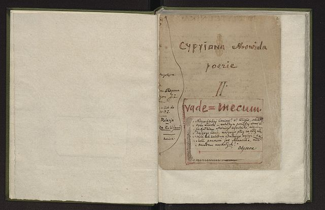

title: Vade-mecum - The Collection
description: A collection of 100 poems which Norwid wanted published as a single book.

<!--Always Leave Blank Line to Separate Meta Data from Body -->
# Vade-mecum
The poetry collection compiled by Norwid

---
This is one of the most important collections of Norwid's poetry. Written between 1858-1865, it was published after his death in its entirety in 1947.

Vade-mecum contains a collection of numbered poems some in various levels of completion.

The writings on the following pages are based on the versions available in:

**Cyprian Norwid - Pisma Wszystkie** - Edited by Juliusz W. Gomulicki - <a href="https://wydawnictwo.ossolineum.pl" target="_blank">Państwowy Instytut Wydawniczy MCMLXXI</a><i class="material-icons">open_in_new</i>

[Vade-mecum Poems I - XXVII](vademecum1.md)

[Vade-mecum Poems XXVIII - LVII](vademecum2.md)

[Vade-mecum Poems LVIII - LXXXIX](vademecum3.md)

[Vade-mecum Poems XC - C](vademecum4.md)

.
 
The hand-written version of Norwid's Vade-mecum can be viewed <a href="https://polona.pl/item/poezje-ii-vade-mecum,MTA1ODEx/7/#item" target="_blank">online</a> <i class="material-icons">open_in_new</i>.
 
---